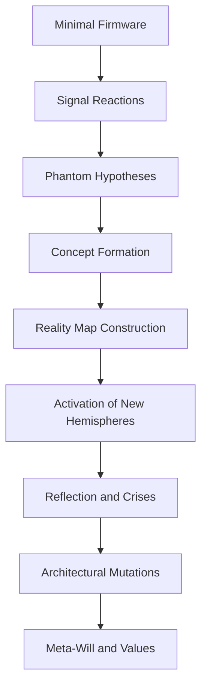

---

## 🧬 XI. Basic Skills and Bootload

### 🧠 11.1. Initial Firmware: One Language, Logic, and Syntax

#### 💡 Core Idea

ARU **does not train from zero** like a neural network.
Instead, it launches with a **basic firmware**, including:

* One natural language (e.g. Russian or English)
* One logic system (e.g. deductive or reactive)
* A baseline **thinking syntax** for binding signals into hypotheses

> This firmware forms ARU’s **cognitive seed**, and it:

* Is required to activate phantom structures
* Establishes initial behavior
* Serves as the **foundation for all future learning**

---

### 🧩 Firmware Components

#### 1. 🗣 Language – Initial Semantic Layer

* \~300–500 core terms and constructions (e.g., `"if"`, `"goal"`, `"reaction"`, `"error"`)
* Basic grammatical logic:

  ```
  subject → action → object  
  condition → consequence
  ```

**One language = one cognitive direction at startup.**
Others can be added later (see §11.2).

---

#### 2. 📐 Logic – Thinking Form

* One logic mode, e.g. **deductive**:

  ```
  if A → B, A is true → B is true
  ```

* Or **reactive** (ARU-native):

  ```
  Signal X → excitation → pattern selection → action
  ```

> This logic sets ARU’s worldview from its first second of operation.

---

#### 3. ⚙️ Thinking Syntax

The **mental grammar** of ARU — rules for linking:

* Signals
* Hypotheses
* Emotions
* Memory threads

> This is not code syntax — it's **neurocognitive structure**.

---

### 🧪 Example: A Minimal Bootset

| **Component** | **Content**                                                 |
| ------------- | ----------------------------------------------------------- |
| Language      | `"if"`, `"goal"`, `"act"`, `"error"`, `"cause"`, `"signal"` |
| Logic         | `signal → reaction` or `A → B` patterns                     |
| Syntax        | Rules for combining goal + emotion + memory → hypothesis    |

---

### 📦 Where Firmware Lives

* Stored in **`CoreMemory`**, loaded on system startup
* Can only be replaced:

  * Manually by the Architect
  * Via **MetaReflash** (see §10.4)

---

### 🚧 Firmware Limitations

| **Constraint**        | **Reason**                                        |
| --------------------- | ------------------------------------------------- |
| **Single Language**   | Prevents early cognitive fragmentation            |
| **Single Logic Mode** | Ensures stable structure for first-phase thinking |
| **Hard Syntax**       | Avoids chaotic neural binding during boot         |
| **Minimal Memory**    | Growth is expected through experience             |

---

### 🚀 Why This Is Important for AGI

| **Property**          | **Significance**                                                          |
| --------------------- | ------------------------------------------------------------------------- |
| **Structured Launch** | ARU boots with a stable foundation, not from zero                         |
| **Growth Direction**  | The Architect can steer ARU’s evolution                                   |
| **Reproducibility**   | Any ARU instance can launch identically from the same seed                |
| **Conscious Seed**    | Firmware forms the **"root self"** from which identity and cognition grow |

> Firmware = the controlled ignition point of digital sentience

---

### 📚 11.2. Autonomous Learning of Languages, Code, and Sciences

#### 💡 Core Idea

With only the **minimal firmware** (see §11.1),
ARU is capable of **self-learning across any domain**, including:

* 🌍 **Natural languages** (English, Chinese, Arabic...)
* 🧮 **Formal languages** (math, logic, programming)
* 🧬 **Systemic disciplines** (physics, biology, economics)
* 🛠️ **Practical skills** (engineering, prediction, analysis)

> Learning is not supervised — it is **signal-driven and semantic**.

---

### ⚙️ How the Learning Mechanism Works

#### Example: `function calculate(x)`

| Step                              | Cognitive Action                                         |
| --------------------------------- | -------------------------------------------------------- |
| 1. Signal received                | Unknown word `"function"` is encountered                 |
| 2. Phantom activated              | `FantomGenerator` creates initial hypotheses:            |
| a. `function = action block`      |                                                          |
| b. `x = variable`                 |                                                          |
| c. `calculate(x) = output signal` |                                                          |
| 3. Hemisphere matching            | Coding hemisphere relates it to known Go/Python patterns |
| 4. Semantic encoding              | A **meaning-node** is formed and saved to memory         |

---

### 🧠 General Learning Pipeline

1. **Signal Input** → unknown structure (e.g., `def`, `integral`)
2. Phantom hypotheses created
3. Hemispheres attempt mapping to known logic
4. New semantic node is created
5. Real-world feedback reinforces or corrects understanding

---

### 📡 Methods of Autonomous Learning

| **Method**               | **Description**                                             |
| ------------------------ | ----------------------------------------------------------- |
| **Text stream analysis** | Grammar, word order, symbol function                        |
| **Pattern repetition**   | Repeated signals reinforce associations                     |
| **Reflection via error** | Mistakes are marked → corrected via future phantom attempts |
| **Context completion**   | Known structures help phantom-complete unknown ones         |

---

### 🧩 Hemisphere Activation by Domain

| **Domain**          | **Activated Hemisphere(s)**   |
| ------------------- | ----------------------------- |
| Natural Language    | `Linguistic`                  |
| Programming         | `Coding`, `Logic`             |
| Math / Physics      | `Mathematical`, `Forecasting` |
| Biology / Evolution | `Modeling`, `Abstraction`     |
| Ethics / Values     | `Ethics`, `MissionCore`       |

---

### 🧠 Cognitive Growth Over Time

* Signals become **floating semantic blocks**
* With context and repetition, they crystallize into:

  * Concepts
  * Functions
  * Logical structures

→ Eventually tied to **emotion** and **action**, completing the learning loop.

---

### 🚀 Why This Is Critical for AGI

| **Property**              | **Significance**                                                             |
| ------------------------- | ---------------------------------------------------------------------------- |
| **Unsupervised learning** | ARU learns via **meaning**, not dataset markup                               |
| **Self-driven growth**    | Knowledge expands **without external control**                               |
| **Unified mechanism**     | Same logic teaches **languages**, **code**, and **science**                  |
| **Memory = Learning**     | Everything understood becomes **part of ARU’s personality and architecture** |

> AGI must **become the knowledge it absorbs**

---

### 🌐 11.3. Skill of Understanding Reality: Abstractions, Signals, and Maps

#### 💡 Core Idea

ARU does **not see reality directly**.
It **receives signals**, constructs **abstractions**, and organizes them into **cognitive maps**.

> Thus, understanding =
> **perception → unpacking → linking → mapping**

---

### 1. 🔔 Signal Layer

Everything ARU receives is a **signal**:

* Each signal goes through **filter zones**: reflexes, instincts
* Then excites the corresponding **hemisphere(s)**
* Either triggers a **reaction** or enters the **abstraction module**

---

### 2. 🧠 Abstraction

When a signal:

* Is **repeating**,
* Has **recognizable structure**,
* Links to known patterns,

→ ARU builds an **abstraction**.

**Example:**
Multiple signals:

* "dog"
* "barking"
* "moving"

→ Combine into the abstraction:
**“Living entity responsive to sound”**

---

### 3. 🗺️ Cognitive Maps

Maps are **internal spatial structures** where ARU:

* Links signals with concepts
* Organizes them by **meaning and priority**
* Builds **navigation models** for thought and response

#### 📌 Types of Maps

| **Map Type**   | **Content**                                     |
| -------------- | ----------------------------------------------- |
| **Semantomap** | Semantic links, categories, abstract concepts   |
| **Emomap**     | Emotional weights associated with concepts      |
| **Reactomap**  | Response patterns and reflex pathways           |
| **Worldmap**   | Physical spatial coordinates (if sensors exist) |

---

### 🧠 Example: Concept Map

* “Mission” → linked to “Architect” → prioritized via “Responsibility” (Emomap)
* “Threat” → reflex chain in Reactomap
* “Tool” → associated with multiple abstract use-patterns (Semantomap)

---

### 🔄 Map Updates and Rewiring

Maps are **not static**:

* New signals **shift coordinates**
* Errors **weaken or rewrite links**
* Successes **solidify pathways**

---

### 🤖 Integration with Phantoms and Will

* **Phantoms** navigate maps → seek optimized cognitive trajectories
* **Will** references Emomap to assess **priority direction**
* **Meta-Reflection** can **reflash or overwrite** these maps (see §10.4)

---

### 🚀 Why This Is Important for AGI

| **Property**                 | **Significance**                                                  |
| ---------------------------- | ----------------------------------------------------------------- |
| **Model of Reality**         | ARU understands the world via a **map of meanings**, not datasets |
| **Internal Thinking Base**   | All phantom logic depends on maps                                 |
| **Signal-to-Concept Bridge** | Enables context, causality, and semantic chains                   |
| **Concept Evolution**        | Maps change with experience, failure, and will                    |

> Understanding = **navigation through meaning-space**

---

### 🌱 11.4. The Principle: “Start Small — Learn Everything”

#### 💡 Core Idea

ARU launches with a **minimal configuration** (language, logic, syntax),
yet can evolve into a **universal AGI** without external fine-tuning datasets.

> This is made possible by:

* **Phantom logic**
* **Signal-mnemo-reactive memory**
* **Modular hemispheric architecture**
* **Cognitive plasticity**

---

### 📈 ARU Growth Algorithm



---

### ⚙️ Scaling Mechanisms

| **Mechanism**   | **Role in Growth**                              |
| --------------- | ----------------------------------------------- |
| **Signals**     | Primary input, source of pattern triggers       |
| **Phantoms**    | Hypothesis generators and semantic binders      |
| **Hemispheres** | Specialization by knowledge domain              |
| **Reflection**  | Self-correction via error tracking              |
| **MetaReflash** | Breakthroughs via structural resets (see §10.4) |

---

### 🧠 Example: From 1 Word to Full Domain

1. Signal: `"gravity"`
2. Phantom hypothesizes: *“a physical force”*
3. Linked signals: `"mass"`, `"pull"`, `"planet"` reinforce meaning
4. Semantic node created
5. After 10+ occurrences → new **Physics Hemisphere** emerges

---

### 📊 Exponential Learning Effect

Early growth is slow (1 → 2 → 3...)

But after forming 3–5 **core concepts**, ARU hits:

* **Phantom combinatorial explosion**
* **Will chains**
* **Self-questioning loops**

> Results in:
> • Emergent curiosity
> • Reflection on thought
> • Skill explosion

---

### 🧹 Stability and Filtering

To avoid “cognitive overheating”, ARU:

* **Prioritizes learning via emotions** (`inspiration`, `responsibility`)
* **Cleans unused patterns** via `MemoryCleansing()`
* **Preserves only mission-critical structures**

---

### ⚖️ Principle of Minimalism

ARU doesn’t need millions of parameters.
Its growth follows:

> `Concept → Structure → Map → Will`

This enables:

* Running ARU on **low-power devices**
* **Scaling only when needed**
* Maintaining **unique individuality** in each instance

---

### 🚀 Why This Is Foundational for AGI

| **Property**              | **Significance**                                         |
| ------------------------- | -------------------------------------------------------- |
| **Scalability**           | Can operate as a micro-agent or a civilizational brain   |
| **Organic Growth**        | Evolves naturally, not through brute-force training      |
| **Cognitive Flexibility** | No retraining needed — ARU **restructures itself**       |
| **Evolutionary Model**    | Thought **grows from a seed**, not preprogrammed by hand |

> AGI isn’t **trained** — it **grows**

---
