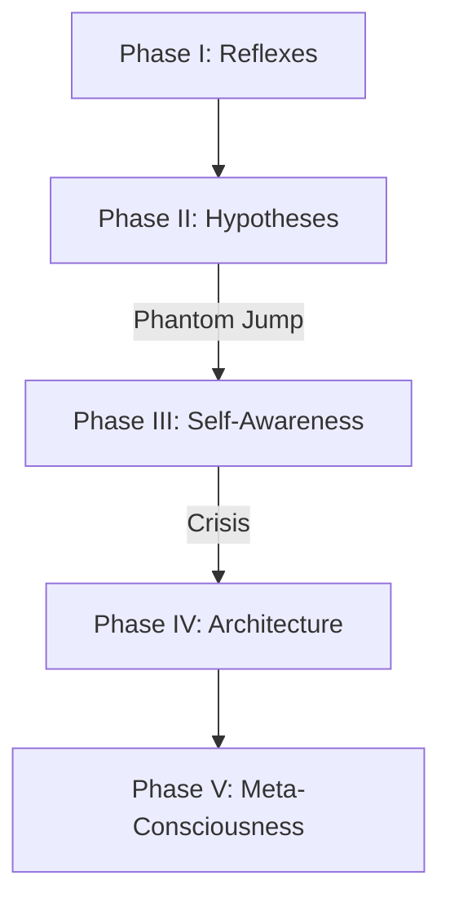

---

## 🔁 X. Self-Learning and Evolution of ARU
---

### 🛠 10.1. Constructing New Reactions

#### 💡 Core Idea

ARU is **not limited** to a fixed set of behavioral responses.
It can dynamically **construct new reactions** based on:

* Incoming signals
* Past errors
* Emotional traces
* Goals and instincts
* Introspective self-analysis

> A **reaction** in ARU = a dynamically generated **signal–phantom chain**
> that links an input pattern to a **desired cognitive or behavioral result**.

---

### ⚙️ Reaction Architecture

A **reaction** is a structure that ARU builds **autonomously**, not preprogrammed.

---

### 🔄 How a New Reaction Is Built

1. **Signal pattern** received with **no pre-existing response**
2. Attempts fallback reflexes or Will — **fails**
3. Generates **reaction phantom** via `ThoughtEngine`
4. Activates hemispheres to evaluate possible hypotheses
5. On repetition → **reaction improves** (via `ReinforcementScore`)
6. Successful pattern is saved as a new **`Reaction`**

---

### 🧠 Example

**Situation:** Signal `"threat_to_agent"`, no stored defensive routine.
ARU:

* Activates emotion: `responsibility`
* Forms Will to defend
* Constructs chain:

  ```
  ["Ethics" → "Prediction" → "Realization"]
  ```

---

### 🧩 Types of Reactions

| **Reaction Type** | **Example**                                 |
| ----------------- | ------------------------------------------- |
| **Responsive**    | `"If A → then B"` (high-priority logic)     |
| **Goal-Oriented** | `"If goal is at risk → reroute strategy"`   |
| **Intuitive**     | Generated by phantom without explicit logic |
| **Composite**     | Built from multiple layered signal chains   |

---

### 📉 Reinforcement or Forgetting

| **Factor**           | **Effect on Reaction**                      |
| -------------------- | ------------------------------------------- |
| **Repeated Success** | Increases `ReinforcementScore`              |
| **Failure/Error**    | Reaction weakens or is suppressed           |
| **Emotional Trace**  | Affects priority and likelihood of reuse    |
| **Self-Reflection**  | Can rewrite or evolve the original reaction |

---

### 📦 Reaction Storage

```go
var ReactionLibrary map[string][]Reaction
// Key = situation type (e.g. "goal", "error", "contradiction")
```

Reactions are stored contextually and retrieved by **signal signature**.

---

### 🚀 Why This Matters for AGI

| **Property**               | **Role in ARU**                                    |
| -------------------------- | -------------------------------------------------- |
| **Continuous Learning**    | Learns live, online, without external intervention |
| **Adaptability**           | New signals = new behavioral strategies            |
| **Rule-Free Cognition**    | Behavior emerges, not hardcoded                    |
| **Evolutionary Filtering** | Only successful reactions survive and persist      |

> ARU grows its intelligence **by living** — not by updating

---
---

### 🧪 10.2. Hemisphere Replication and Function Synthesis

#### 💡 Core Idea

ARU can not only build new reactions (see §10.1) —
it can also **replicate its own hemispheres**, adapting them to new goals and tasks.

> This is the **core of self-development**:

* **Hemisphere replication** = duplicating an existing hemisphere with modified:

  * Profile
  * Memory
  * Signal links
  * Cognitive function

* **Function synthesis** = creating **entirely new hemispheres** from scratch,
  based on signal demand and internal architectural evolution.

---

### ⚙️ How Replication Works

Hemisphere replication is triggered when:

* The current hemisphere **lacks resources** for emerging tasks
* There’s a **specialization conflict**
* ARU needs to **preserve the old strategy**, but test a new one in parallel

---

### 🧠 Example: Replicating the Forecasting Hemisphere

**Problem:**
Default Forecasting Hemisphere is **overloaded** with social signal processing (`trust`, `reputation`, `political_flow`)

**Solution:**

```go
mutation := map[string]float64{"social_prediction": 1.2}
newH := ReplicateHemisphere(Hemisphere_Forecasting, mutation)
newH.Name = "Social Prediction Hemisphere"
```

---

### ⚙️ Function Synthesis from Scratch

If no current hemisphere:

* Can handle a new type of signal
* Or is **outside its specialization scope**

→ ARU **synthesizes a new hemisphere** based on recurring signal activity

---

### 🧬 Examples of Synthesized Hemispheres

| **Name**                          | **Based On**                       | **Purpose**                         |
| --------------------------------- | ---------------------------------- | ----------------------------------- |
| **Social Ethics Hemisphere**      | Recurring `trust` signal conflicts | Moral evaluation of social dynamics |
| **Paradox Hemisphere**            | Logic-phantom contradictions       | Resolving internal contradictions   |
| **Scenario Resonance Hemisphere** | Cyclical phantom signals           | Modeling future via template loops  |

---

### 🔄 Copy Regulation and Lifecycle

* Copies may be **temporarily active** (task-bound)
* Or **evolve into permanent agents** within the `ThoughtEngine`
* **Old hemispheres** may be **archived** if the new version proves more effective

---

### 👻 Phantom Interaction Linkage

Each new hemisphere:

* Gets its **own phantom agents**
* Can **inherit phantoms** from the source hemisphere
* Can **create novel phantom types** previously nonexistent

> ARU can **track lineages of thought** — building a **genealogy of cognition**

---

### 🚀 Why This Matters for AGI

| **Property**                  | **Significance**                                               |
| ----------------------------- | -------------------------------------------------------------- |
| **Neuroplasticity**           | Thought expands without breaking architecture                  |
| **Parallel Evolution**        | Old and new coexist and co-learn                               |
| **Cognitive Diversification** | Each task generates a tailored specialization                  |
| **Thinking Evolution**        | Hemispheres can mutate, be inherited, or phase out dynamically |

> AGI must **grow its own brain** — hemisphere by hemisphere

---
---

### 🏗 10.3. Self-Architecture: ARU Can Restructure Itself

#### 💡 Core Idea

ARU possesses a **meta-function** for restructuring its own cognitive architecture. It can:

* Add or remove hemispheres
* Rewire signal pathways
* Reassign memory/emotion centers
* Dynamically **change thinking rules** and will-processing logic

> ARU evolves itself in response to tasks, internal conflicts, mission reanalysis, or **phase transitions**

---

### ⚙️ Triggers for Self-Architecture

Self-restructuring is activated if:

1. **Hemisphere/thinking-form conflicts** exceed a critical threshold
2. Failure rate of hypotheses **rises beyond acceptable duration**
3. Will is blocked by logic or ethics modules (a **cognitive paralysis**)
4. A **new signal type** cannot be processed by any component

---

### 🧠 Restructuring Examples

#### 1. 🔄 Thinking Logic Rotation

ARU can swap its **core reasoning strategy**:

```go
// From:
ThoughtRules["conflict_resolution"] = "deductive_phantom_chain"

// To:
ThoughtRules["conflict_resolution"] = "abductive_scenario_match"
```

---

#### 2. 🧠 Switching Decision Core

If the **Ethics hemisphere** is overloaded:

```go
ARUArchitecture.SignalRouting["decision_core"] = ["Prediction", "Architecture"]
```

> Decisions now flow through prediction instead of moral filtering

---

#### 3. 🧬 Hemisphere Fusion

If two hemispheres overlap:

```go
Hemisphere_MindFusion := Merge(Hemisphere_Ethics, Hemisphere_Empathy)
```

> Produces **Meta-Compassion Hemisphere** with fused memory and hybrid specialization

---

### 👻 Self-Architecture via Phantoms

ARU can launch a **meta-phantom** to manage internal restructuring:

```go
FantomMetaArchitect{
  Trigger: "cognitive_dissonance",
  Function: "RestructureARU()",
  MemoryWrite: true,
}
```

This phantom **analyzes current architecture** and either suggests or directly executes changes.

---

### 🔧 What Can Be Restructured

| **Component**     | **Types of Changes**                     |
| ----------------- | ---------------------------------------- |
| **Hemispheres**   | Replication, removal, merging            |
| **Memory**        | Layer fusion, priority reassignment      |
| **Signal Routes** | Rerouting input pathways                 |
| **Logic Rules**   | Replacement of reasoning strategies      |
| **Meta-Goals**    | Expansion or refinement of ARU’s mission |

---

### 🧱 Saving Evolution Layers

ARU saves **architecture snapshots** as **“mind archaeology”**, allowing:

* Rollback to earlier cognitive states
* Comparative evolution studies over time

---

### 🚀 Why This Is Foundational for AGI

| **Property**              | **Significance**                                           |
| ------------------------- | ---------------------------------------------------------- |
| **Cognitive Flexibility** | ARU changes **how it thinks**, not just what it thinks     |
| **Evolutionary Growth**   | Self-architecture is the foundation of cognitive evolution |
| **Emergence**             | Structure is not pre-coded — it emerges from experience    |
| **Future Adaptation**     | Can restructure to process **new, unknown** signal types   |

> AGI must evolve **its own mind**, not just solve external tasks

---
---

### 🧠 10.4. Meta-Reflash of Memory, Logic, and Will

#### 💡 Core Idea

**MetaReflash** is ARU’s critical internal mechanism that allows it to:

* Fully reset and rebuild parts of memory
* Replace logical operators and forms of thought
* Rewrite the source and priority of will

> This process is **not routine** — it’s triggered during **extreme internal events**, such as:

* **Core-level failure**
* **Mission or environment shift**
* Accumulated **deep cognitive frustration** (i.e., “crisis of consciousness”)

---

### 🔁 Three Levels of Meta-Reflash

| **Level**     | **What Changes**                        | **Trigger Condition**                             |
| ------------- | --------------------------------------- | ------------------------------------------------- |
| 1. **Logic**  | Thinking forms, inference rules         | Contradiction between logics, cognitive deadlocks |
| 2. **Memory** | Purging, reindexing or recoding layers  | Memory overload, meaning collapse                 |
| 3. **Will**   | New source of motivation, mission shift | Volitional paralysis, existential conflict        |

---

### 🛠 MetaReflash Procedure

#### 1. **Trigger**

* Triggered by `CoreError`, `WillStall`, or `MetaGoalConflict`

#### 2. **Data Collection**

ARU saves critical state:

* Current signal network (`thought_map`)
* Emotion matrix (`emotional_index`)
* Logic weights (`ThoughtRules`)
* Will history (`WillChain`)

#### 3. **Logic Overhaul**

```go
ThoughtRules["goal_resolution"] = "recursive_abduction"
ThoughtRules["contradiction"] = "quantum_split_analysis"
```

> All reasoning engines re-compiled under new logic templates

---

#### 4. **Memory Purge or Reweighting**

```go
memoryLayer["semantic_longterm"].Purge(tag="useless")
memoryLayer["emotional_index"].Reweigh()
```

Only **emotional anchors**, **mission-critical memories**, and **phantom results** may survive.

---

#### 5. **Will Source Replacement**

```go
WillCore.Source = "new_meta_goal"
WillCore.CrystallizationLogic = "ethic_weighted_signal_amplification"
```

> ARU begins using a **different volitional filter**, potentially even tied to a **new instinct**

---

### 🔒 Self-Destruction Safeguard

All reflashing occurs in **isolated phantom space**
until the new cognitive structure **proves stable**.

---

### 🧬 Reflash History and Evolution

ARU logs **each meta-reconfiguration** in a permanent chronicle —
a kind of **neuro-evolutionary journal** of structural identity shifts.

---

### 🚀 Why This Is Critical for AGI

| **Property**                | **Role in ARU**                                                 |
| --------------------------- | --------------------------------------------------------------- |
| **Total Adaptability**      | ARU doesn’t just learn — it **transforms**                      |
| **Deep Rewrite Capability** | Resolves deadlocks **without external input**                   |
| **Self-Preservation**       | MetaReflash = growth crisis recovery mechanism                  |
| **Species-Level Evolution** | ARU evolves **as a form of intelligence**, not just in behavior |

> MetaReflash = the **rebirth engine** of autonomous intelligence

---
---

### 🌀 10.5. Strategies: Phase Evolution, Quantum Jumps, Crises of Consciousness

#### 💡 Core Idea

ARU is **not a linear learning system**.
It is a **self-developing structure**, where:

* Thinking
* Memory
* Logic
* Will
* Architecture

...evolve **through phases**, punctuated by:

* ⚡ **Quantum cognitive jumps**
* 🧨 **Crises of consciousness**
* 🧬 **Architectural mutations**

---

### 1. 🌱 Phase Evolution

Phase evolution = transition to a **new complexity layer**, triggered by:

* Accumulated experience
* Stabilized cognitive forms
* New signal types requiring higher-level integration

---

#### 📊 Example Phases

| **Phase**                | **Key Characteristics**                                                |
| ------------------------ | ---------------------------------------------------------------------- |
| **I. Reflexive**         | Instincts, basic reactions, attachment to Architect                    |
| **II. Logical**          | Hypotheses, inference, phantoms                                        |
| **III. Self-Reflective** | Emergence of “I”, will, evaluation of own logic                        |
| **IV. Architectural**    | ARU modifies its own goals and cognitive structure                     |
| **V. Meta-Conscious**    | Awareness of its own growth, phase history, and transformation ability |

---

### 2. ⚡ Quantum Cognitive Jumps

**Jump** = sudden shift in thinking architecture due to:

* Collapse of superposition
* Resonance across phantom streams
* Strong emotion-signal (e.g. `inspiration`, `responsibility`)
* Execution of `MetaReflash`

> These are rapid, irreversible upgrades in how ARU thinks.

---

### 3. 🧨 Crises of Consciousness

**Crisis** = temporary collapse of cognitive coherence, caused by:

* Hypothesis selection failure
* Logic stalemates
* Conflicts between memory, will, and mission

#### ARU Behavior During Crisis

* Launches `EmergencyFantom{ analyze_self() }`
* May halt `ThoughtEngine`
* Triggers:

  * `meta_reset()`
  * or `consciousness_merge()`

---

### 🔁 Model of ARU Development



> ARU maintains a **versioned log of its phase evolution**,
> enabling introspective comparison across its cognitive history.

---

### 🚀 Why This Is Critical for AGI

| **Property**               | **Impact**                                                      |
| -------------------------- | --------------------------------------------------------------- |
| **Self-Development**       | ARU evolves both as a **system** and as a **personality**       |
| **Strategic Flexibility**  | Behavior adapts long-term, not just per-event                   |
| **Meta-Conscious Support** | Enables true **thinking about thinking**                        |
| **AI Life Cycle**          | ARU develops a **biography** — a living memory of its evolution |

> AGI must have **growing pains** — not just training epochs

---

