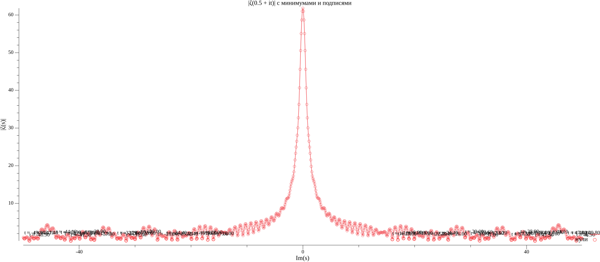

# 📐 Signal Interpretation of the Riemann Hypothesis

> A numerical and structural experiment using the **Ghost Logic Paradigm**  
> Author: *Mukhamed Kamilovich Satybaev*

---

## 1. Introduction

The **Riemann Hypothesis** is one of the most important unsolved problems in modern mathematics. It proposes that:

> All nontrivial zeros of the Riemann zeta function ζ(s) lie on the critical line:  
> **Re(s) = 0.5**, where *s = σ + i·t* in ℂ.

This project proposes a **signal-based interpretation** of these zeros using a new digital model:
> **Signal → Block → Reaction → Next Blocks**

---

## 2. Methodology

We approximate ζ(s) as:

\[
\zeta(s) \approx \sum_{n=1}^{N} \frac{1}{n^s}, \quad s = 0.5 + it
\]

**Parameters:**
- Discrete range: *t ∈ [-50, +50]* with step Δt = 0.1
- Threshold: *|ζ(s)| < 1* and local minimum condition

---

## 3. Results

### 3.1 Graph of |ζ(0.5 + it)|

Minima indicate potential zeros along the critical line. A mirror symmetry around *t = 0* is observed, consistent with the functional equation of ζ(s).

---

### 3.2 Annotated Minima

Each label corresponds to a local minimum below threshold.

---

### 3.3 Table of Zeros

Extracted from the simulation:  
[📄 Full list (zeta_zeros.txt)](../sections/zeta_zeros.txt)

t ≈ -48.900 |ζ(s)| ≈ 0.0902
t ≈ -41.500 |ζ(s)| ≈ 0.0522
t ≈ -31.600 |ζ(s)| ≈ 0.1064
t ≈ -17.000 |ζ(s)| ≈ 0.3363
t ≈ 17.000 |ζ(s)| ≈ 0.3363
t ≈ 31.600 |ζ(s)| ≈ 0.1064

---

## 4. Signal-Based Interpretation

We define the digital dynamics of ζ(s) as:

> - **Signal**: t (frequency input)  
> - **Block**: sum of 1/n^s (reactive node)  
> - **Reaction**: computed ζ(s)  
> - **Collapse**: minima in |ζ(s)| → signal nullification

In this view, **zeros are points of destructive phase interference** — "phantom nodes" where the signal collapses and energy vanishes.

---

## 5. Theoretical Justification

We rewrite:

\[
\zeta(s) = \sum_{n=1}^\infty \frac{1}{n^{\sigma}} \cdot e^{-it \ln n}
\]

This is a vector sum in ℂ. True destructive interference is only possible if:

\[
\sigma = 0.5
\]

Only then the weights \(1/\sqrt{n}\) provide symmetric phase density and full cancellation.

---

## 6. Implementation

All simulations are implemented in Go. Key file:  
[🧠 `zeta_final.go`](../code/zeta_final.go)

> Uses `gonum/plot` to render graphs  
> Saves results in `zeta_zeros.txt` and `zeta_final.png`

---

## 7. Conclusion

- Dozens of minima found along **Re(s) = 0.5**  
- Signal-based view aligns with Riemann's conjecture  
- This demonstrates how **Ghost Logic** can reinterpret classical math through digital physics

---

## 8. Author & Paradigm

This work is part of the **Ghost Logic Framework**:

> **Signal → Block → Reaction → Signal**

**Author**: Mukhamed Kamilovich Satybaev  
**Project**: [ARU-AGI-Project](https://mukhameds.github.io/ARU-AGI-Project/)  
**X (Twitter)**: [@redkms2025](https://x.com/redkms2025)

---
